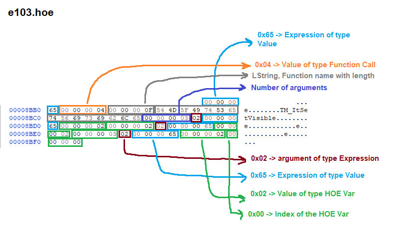
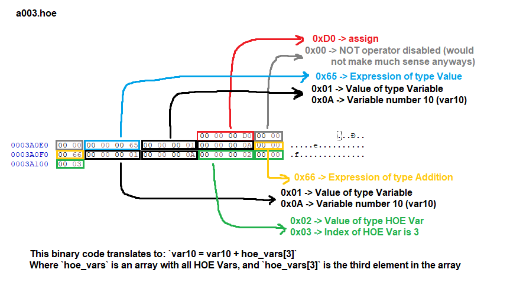

# The HOE language
The events in HOE files include code in a binary non standard language, let's
call it "the HOE language" or "hoelang". There are some details about the format
that are still unknown, some things might be explained in a weird way because
there is no better way to explain it yet. More researches are needed. Note that
everything is written in Big endian, meaning the Most Significant Byte comes
at last.

The binary code starts with a 4 byte integer, which can be 0 or 1. Depending on
this number, the start of the code looks different.

If there's a 0, you have the following structure.

| Type          | Size | Name           | Description                                        |
|---------------|------|----------------|----------------------------------------------------|
| uint32 (0x00) | 4    | First number   | Tells you if there's a Mask structure at the start |
| Main          |      | Main structure | The Main structure of the Hoelang code (see below) |

If you have a 1, you have some additional stuff before the Main structure:

| Type               | Size | Name           | Description                                                       |
|--------------------|------|----------------|-------------------------------------------------------------------|
| uint32 (0x01)      | 4    | First number   | Tells you if there's a Mask structure at the start                |
| LString            |      | Mask name      | It just says "Mask"                                               |
| uint32             | 4    | ??? nb_uk_ints | ??? The number of integers that are coming                        |
| uint32[nb_uk_ints] |      | uk_ints        | Unknown integers                                                  |
| uint32             | 4    | ??? nb_m1      | ??? The number of -1s that are coming                             |
| uint32[nb_m1]      |      | m1             | Just minus ones? `0xFF FF FF FF`                                  |
| uint32             | 4    | ??? number1    | ??? Some number                                                   |
| uint32             | 4    | ??? number2    | ??? Some number                                                   |
| Block              |      | ??? Block      | ??? Just a block (see Block below)                                |
| uint32             | 4    | ??? number3    | ??? Some number                                                   |
| Expression         |      | ??? Expression | ??? Just an expression (see Expression below)                     |
| Main               |      | Main structure | The Main structure of the Hoelang code (see Main structure below) |

In these tables some types of structures are mentioned, like Block, Expression,
or Main structure, so let's explain these structures.

## Hoelang Main structure
The main structure of Hoelang codes is the following:

| Type                 | Size | Name        | Description                                                  |
|----------------------|------|-------------|--------------------------------------------------------------|
| uint32               | 4    | Nb_blocks   | Number of blocks                                             |
| Block[Nb_blocks]     |      | Blocks      | The number of starting blocks                                |
| uint32               | 4    | Nb_If_Thens | The number of If_Thens in the infinite loop                  |
| If_Then[Nb_If_Thens] |      | If_Thens    | A sequence of If_Thens that are executed in an infinite loop |

Basically they start with a sequence of blocks ("starting blocks") that are
executed once, then a sequence of If_Thens that are executed in a loop. You have
to imagine this main structure like this C code:

```c
int main()
{
    execute_blocks();
    while (1)
    {
        execute_if_thens();
    }
    return 0;
}
```

In order to exit the while loop, the function `NoMoreUpdate()` needs to be
called (you will learn how functions are called later in this page).

## If_Then Structure
These structures let us execute certain parts of the code only if some
conditions are met. The syntax slightly varies depending of the type of If_Then
Structure. The type is determined by the first 1 byte number. If the first
number (HOE_IF_TYPE) is `0x01` the structure is the following:

| Type                  | Size | Name           | Description                                              |
|-----------------------|------|----------------|----------------------------------------------------------|
| HOE_IF_TYPE (0x01)    | 1    | If type        | Tells you what's inside of the Then                      |
| uint32                | 4    | If_nb_blocks   | The number of blocks inside the If                       |
| Block[If_nb_blocks]   |      | If blocks      | A sequence of blocks, each being a condition in the If   |
| uint32                | 4    | Then_nb_blocks | The number of blocks inside the Then                     |
| Block[Then_nb_blocks] |      | Then blocks    | A sequence of blocks, each being executed in the Then    |

If the first number is `0x02` the structure is the following:

| Type                      | Size | Name             | Description                                             |
|---------------------------|------|------------------|---------------------------------------------------------|
| HOE_IF_TYPE (0x02)        | 1    | If type          | Tells you what's inside of the Then                     |
| uint32                    | 4    | If_nb_blocks     | The number of blocks inside the If                      |
| Block[If_nb_blocks]       |      | If blocks        | A sequence of blocks, each being a condition in the If  |
| uint32                    | 4    | Then_nb_If_Thens | The number of If_Thens inside the Then                  |
| If_Then[Then_nb_If_Thens] |      | Then If_Thens    | A sequence of If_Thens, each being executed in the Then |

As you can see the only difference is that when the HOE_IF_TYPE is 2, the Then
is a sequence of If_Thens instead of a sequence of Blocks. So the If_Thens of
type 2 let you have more conditions inside the Then, something like this:

```c
if (a)
{ // then
    if (b)
    { // then
        /* ... */
    }
}
``` 

Also note that all the conditions inside the If must be met to execute the Then,
so you should imagine that there's an AND logical operator between the
conditions in the If.

## Block
A block basically lets you to assign a value to a variable, or compare two
expressions. For all OP codes except `0xC9` it has the following syntax:

| Type        | Size | Name          | Description                                               |
|-------------|------|---------------|-----------------------------------------------------------|
| HOE_OP_CODE | 4    | Block OP code | Tells you what type of operation must be done.            |
| uint32      | 4    | Not boolean   | Can be 0 or 1. If 1, the NOT logical operator is applied. |
| Expression  |      | Expression 1  | First operand.                                            |
| Expression  |      | Expression 2  | Second operand.                                           |

For the `0xC9` OP code, we only have one operand:

| Type               | Size | Name          | Description                                               |
|--------------------|------|---------------|-----------------------------------------------------------|
| HOE_OP_CODE (0xC9) | 4    | Block OP code | Tells you what type of operation must be done.            |
| uint32             | 4    | Not boolean   | Can be 0 or 1. If 1, the NOT logical operator is applied. |
| Expression         |      | Expression    | Operand.                                                  |

Here's the list of the different OP codes:

| HOE_OP_CODE | Description                 |
|-------------|-----------------------------|
| 0xD0        | Assign                      |
| 0xCA        | Equal comparison            |
| 0xCB        | Not equal comparison        |
| 0xCC        | Greater than comparison     |
| 0xCD        | Lower than comparison       |
| 0xCE        | Greater or equal comparison |
| 0xCF        | Lower or equal comparison   |
| 0xC9        | Convert to boolean (?)      |

## Expression
Expressions represent a value (when I type "value" with a lowercase 'v' I mean
the common word, when I type "Value" with an uppercase 'V' I mean the Value
structure). Depending on the first number (let's call it Expression OP code),
they have a different format. Here's a list of them:

| HOE_EXPR_OP_CODE | Description    |
|------------------|----------------|
| 0x65             | Some value     |
| 0x66             | Addition       |
| 0x67             | Subtraction    |
| 0x68             | Multiplication |
| 0x69             | Division       |
| 0x6A             | Modulo         |

For all these codes except Value (0x65), the syntax is the following:

| Type             | Size | Name               | Description                           |
|------------------|------|--------------------|---------------------------------------|
| HOE_EXPR_OP_CODE | 4    | Expression OP code | Tells you how the value is determined |
| Value            |      | Value 1            | First operand                         |
| Value            |      | Value 2            | Second operand                        |

For the 0x65 Expression we have this format:

| Type             | Size | Name               | Description                           |
|------------------|------|--------------------|---------------------------------------|
| HOE_EXPR_OP_CODE | 4    | Expression OP code | Tells you how the value is determined |
| Value            |      | Value              | The value                             |

The Value can be retrieved in different ways depending on the second number (the
one after the `0x65`). Note that these Values don't have the OP code, they start
with the second number. If that's confusing, check the examples
[below](#examples). Here's a list of the different types of Value:


| HOE_VALUE_TYPE | Description                            |
|----------------|----------------------------------------|
| 0x01           | Variable                               |
| 0x02           | HOE_Var (these are actually constants) |
| 0x03           | Unknown type of value                  |
| 0x04           | Function call                          |
| 0x06           | Some special function call?            |

Depending on the type of Value we have different formats.

### Variable (0x01)
These types of variables are defined inside of the code. They have an index, so
the first variable has an index of `0`, the next one has an index of `1`, and
so on. Variables have actually names, the names can be retrieved with the index
and the LStrings in the HOE event, but the method to retrieve the name is
unknown (the index does not just represent the index of the name in the LStrings
list, that would be too easy). Here's the format of an Expression of type 0x65
(Value), with a Value type 0x01 (variable), with an index of "Variable index":

| Type                    | Size | Name               | Description                         |
|-------------------------|------|--------------------|-------------------------------------|
| HOE_EXPR_OP_CODE (0x65) | 4    | Expression OP code |                                     |
| HOE_VALUE_TYPE (0x01)   | 4    | Type of value      |                                     |
| uint32                  | 4    | Variable index     | Tells you the index of the variable |

### HOE vars (0x02)
These are refered to in the documentation as "HOE Vars", but they're actually
not variables, they're constants. They are defined in the "Vars" field of the
HOE Events. To sum it up, each HOE event has a list of constants, each can be
an integer or a float, these are the "HOE Vars". In the code, each HOE Var is
referred to by its index in the list. So here's the format of an Expression of
type 0x65 (Value), with a Value of type 0x02 (HOE Var), with an index of "HOE
Var index":

| Type                    | Size | Name               | Description                         |
|-------------------------|------|--------------------|-------------------------------------|
| HOE_EXPR_OP_CODE (0x65) | 4    | Expression OP code |                                     |
| HOE_VALUE_TYPE (0x02)   | 4    | Type of value      |                                     |
| uint32                  | 4    | HOE Var index      | Tells you the index of the HOE Var  |

### Unknown value type (0x03)
It is unknown what these represent, but they have more or less the same format
as the previous two types of Value:

| Type                    | Size | Name               | Description |
|-------------------------|------|--------------------|-------------|
| HOE_EXPR_OP_CODE (0x65) | 4    | Expression OP code |             |
| HOE_VALUE_TYPE (0x03)   | 4    | Type of value      |             |
| uint32                  | 4    | ??? Some number    | ???         |

### Function call (0x04)

| Type                      | Size | Name               | Description                               |
|---------------------------|------|--------------------|-------------------------------------------|
| HOE_EXPR_OP_CODE (0x65)   | 4    | Expression OP code |                                           |
| HOE_VALUE_TYPE (0x04)     | 4    | Type of value      |                                           |
| LString                   |      | Function name      | The length of the name, and then the name |
| uint32                    | 4    | Nb_args            | Number of arguments the function takes    |
| HOE_Function_Arg[Nb_args] |      | Arguments          | The arguments given to the function       |

The HOE_Function_Arg has a different format depending on the first number, which
is a 1 byte number that can take the following values:

| HOE_ARG_TYPE | Description        |
|--------------|--------------------|
| 0x01         | Immediate argument |
| 0x02         | HOE_Var            |

In case it's an Immediate argument, we have this format:

| Type                | Size | Name               | Description                        |
|---------------------|------|--------------------|------------------------------------|
| HOE_ARG_TYPE (0x01) | 1    |                    |                                    |
| uint32              | 4    | Immediate argument | The argument as an immediate value |

In case it's a HOE Var, we have this format:

| Type                | Size | Name                | Description                   |
|---------------------|------|---------------------|-------------------------------|
| HOE_ARG_TYPE (0x02) | 1    |                     |                               |
| Expression          |      | Expression argument | The argument as an Expression |

### Special function call ? (0x06)
It has the same exact format as the Function call (0x04), but uses `0x06`
instead of `0x04`. It might represent something else like the creation of a
structure or class or something, more researchs is needed.

## Examples

Here's an example of what an Expression of type Function call looks like:



Here's an example of what an Assign Block and an Addition Expression look like:

